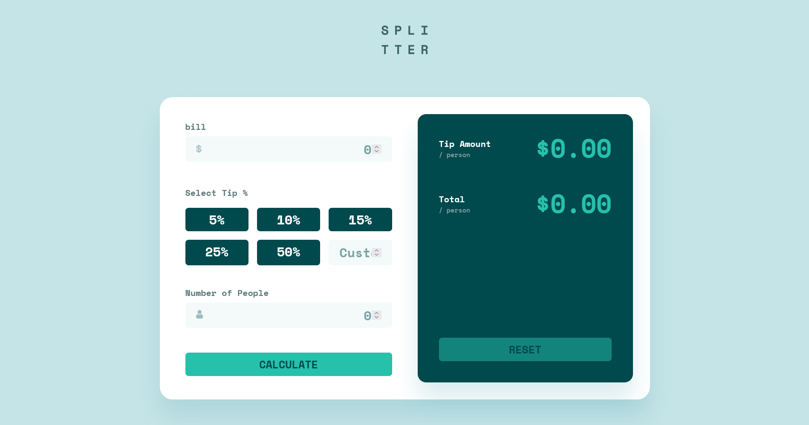

# Frontend Mentor - Tip calculator app solution

This is a solution to the [Tip calculator app challenge on Frontend Mentor](https://www.frontendmentor.io/challenges/tip-calculator-app-ugJNGbJUX). Frontend Mentor challenges help you improve your coding skills by building realistic projects.

## Table of contents

- [Overview](#overview)
  - [The challenge](#the-challenge)
  - [Screenshot](#screenshot)
  - [Links](#links)
- [My process](#my-process)
  - [Built with](#built-with)
  - [What I learned](#what-i-learned)
- [Author](#author)

## Overview

### The challenge

Users should be able to:

- View the optimal layout for the app depending on their device's screen size
- See hover states for all interactive elements on the page
- Calculate the correct tip and total cost of the bill per person

### Screenshot

### Links

- [GitHub Repository](https://github.com/kaamiik/fm-tip-calculator-app-using-tailwind-typescript-with-testing)
- [Vercel Live Preview](https://tip-calculator-app-with-testing-kia.vercel.app/)

## My process

### Built with

- Semantic HTML5 markup
- CSS custom properties
- Flexbox
- CSS Grid
- Mobile-first workflow
- Component Based
- Unit Tests
- Accessibility
- [TypeScript](https://www.typescriptlang.org/)
- [React Hook Form](https://react-hook-form.com/)
- [Zod](https://zod.dev/)
- [Testing with Vitest](https://vitest.dev/)
- [React](https://reactjs.org/)
- [TailwindCSS](https://tailwindcss.com/)

### What I learned

I rewrote this challenge to practice and begin my testing journey, starting with **Unit Testing**.

I first built the UI, focusing on semantic HTML, a mobile-first responsive layout, and clean CSS.  
Following React best practices, I split the interface into small, reusable components based on the design.

After the UI was ready, I implemented form validation using **react-hook-form** together with **zod**.

Working with native `<input type="number" />` fields and zod validation was challenging because different browsers handle number inputs differently.  
Additionally, the app includes a group of tip percentage radio buttons plus a custom numeric input.  
To unify the related error messages, I used zod’s `superRefine` to combine multiple validation rules and provide a single, clear error output.

The form calculates the tip and total amount per person on submit, and uses RHF’s `reset()` for the reset button.  
I also added `aria-live` attributes to the error messages and result outputs to improve accessibility for screen readers.

Finally, I configured testing using **Vitest**, which is widely recommended for Vite projects and an alternative to Jest.

I wrote unit tests for:

- `getResults` — the main tip calculation function  
- `handleKeyDown` — keyboard-related utility behavior  
- `tipSchema` — form validation logic with zod  

After that, I added **Happy Path** and **Unhappy Path** tests to simulate real user behavior:  
filling the form, submitting it, handling errors, and ensuring that results appear only when the input is valid.

## Author

- Frontend Mentor - [@kaamiik](https://www.frontendmentor.io/profile/kaamiik)
- X - [@kiaakamran](https://www.x.com/kiaakamran)